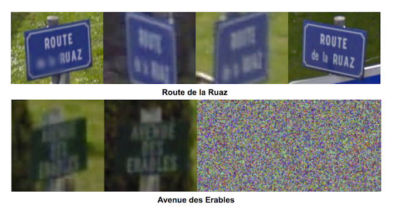

## "Big data"

<figcaption>Source: AdAge.com</figcaption>

---

## "Big data"

<figcaption>Source: [Dallas Business Journal](https://www.bizjournals.com/dallas/news/2018/02/07/by-expanding-in-denton-county-hillwood-brings.html)</figcaption>

---

## GIS and big data

Industry examples: 

* Sensors & "smart cities"
* Transportation (ride sharing & self-driving cars)
* Cell phone data/location analytics
* Deep learning/anything Google does

---

## Sensors and "smart cities"

<iframe width="560" height="315" src="https://www.youtube.com/embed/ZkkM8iYAagQ?rel=0" frameborder="0" allow="autoplay; encrypted-media" allowfullscreen></iframe>

---

## Uber

* 40 million rides/month; 2 billion rides as of 2016

* Data: [Uber Movement](https://movement.uber.com)

---

## Self-driving cars

---

## Self-driving cars

<figcaption>Source: [Sanborn Maps](http://www.sanborn.com/highly-automated-driving-maps-for-autonomous-vehicles/)</figcaption>

---

## Self-driving cars

<figcaption>Source: _The New York Times_</figcaption>

---

## Cell phone data 

* [Lessons Learned from Analyzing Over a Million Points of GPS Data - CARTO](https://carto.com/blog/lessons-learned-analyzing-million-points-GPS-data/)
* [Politics really is ruining Thanksgiving, according to data from 10 million cellphones](https://www.washingtonpost.com/news/wonk/wp/2017/11/15/politics-really-is-ruining-thanksgiving-according-to-data-from-10-million-cellphones/?utm_term=.b6a91e6c385f)

---

## Cell phone data and location tracking

<iframe src="https://abcnews.go.com/video/embed?id=47826213" width="700" height="475" scrolling="no" style="border:none;" allowfullscreen></iframe>

---

## Google Maps!

* Google Imagery: https://lp.google-mkto.com/Google-imagery.html

---

## Deep learning and Google Maps

* [Google Maps & deep learning examples](https://research.googleblog.com/2017/05/updating-google-maps-with-deep-learning.html)

---

## Try it out: Google's Vision API

* https://cloud.google.com/vision/

